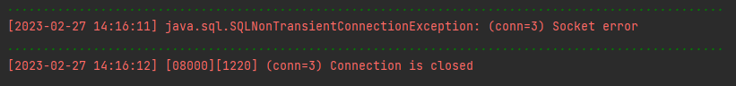
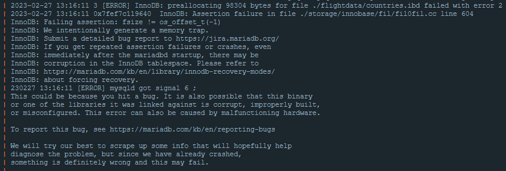

# Fix für den Error auf Windows beim Ausführen vom SQL-Script für die Sample-Databases

Verfasser: **Leo Mühlböck, Leopold Kernegger**

Datum: **27.02.2023**

## Einführung

Bei der Verwendung von Datenbankmanagement-Systemen wie MariaDB wird oft auf Docker zurückgegriffen, um schnell und einfach eine Datenbank zu erstellen und zu verwalten. Mit Docker können auf allen gängigen Betriebssystemen wie Windows und Linux Container virtualisiert werden. Für MariaDB exestiert bereits ein [vorgefertigtes Docker Image](https://hub.docker.com/_/mariadb), basierend auf Ubuntu. 

Vor allem bei einer Datenbank ist es wichtig, dass die Daten nicht an den Docker-Container gebunden sind und extern gespeichert werden. Bei Docker wird dies meist mit sogenannten Volumes gelöst. Genau das wurde bei der Ausführung des SQL-Scripts allerdings zum Problem.

## Problembeschreibung

Wenn im MariaDB-Container, definiert durch das Docker-Compose-File [AUSGANGSDATEI-docker-compose.yaml](AUSGANGSDATEI-docker-compose.yaml), das (sehr große) SQL-Script [Sample_Databases_FULL.sql](Sample_Databases_FULL.sql) auf Windows ausgeführt wird, passiert nach etwa 15 Sekunden folgendes:

- SQL-Error:

  

  Dieser ist zurückzuführen auf:

- MariaDB-Error:

  

Der Fehler "preallocating [...] bytes for file [...] failed" lässt bereits erahnen, dass das Problem mit dem Filesystem zu tun hat. 

Um es nochmal zu erwähnen, dieser Fehler tritt nur auf Windows auf. Auf UNIX-Basierenden Betriebssystemen wie MacOS funktioniert das Skript.

## Lösungsweg

Am Anfang haben wir uns jedoch auf falsche Error fokussiert:

Zuvor hatte ich noch kurz die Idee, dass es an der Firewall lag, was jedoch schnell mithilfe des Source Commands von MariaDB für falsch erklärt wurde.
Danach fokussiert ich mich auf diesen Fehler.

```

2023-02-23 14:12:47 Trying to get some variables.
2023-02-23 14:12:47 Some pointers may be invalid and cause the dump to abort.
2023-02-23 14:12:47 Query (0x7f09d001ce90): INSERT INTO flightdata.countries (code, name) VALUES ('AD', 'Andorra')
2023-02-23 14:12:47 
2023-02-23 14:12:47 Connection ID (thread ID): 3
2023-02-23 14:12:47 Status: NOT_KILLED
```
Hier errort nicht MariaDB oder die Virtualmachine selbst, sondern der Coredump. Es wird nähmlich versucht den gesamten Ram zum Zeitpunkt des Crashes auf Disk zu writen. Da die Virtual-Machine jedoch abgestürtzt ist komplett und der Ram durch das Container-Problem onehin schon korrupted ist, sind einige der Pointer invalide.

Das führte dazu, dass ich dachte das es an einem Ram-Problem liegt, um dies auf die schnelle zu testen machte ich einen Docker-Container rein in der CLI, ohne ein Ram Setting.

```bash
docker run -e MARIADB_ROOT_PASSWORD=mypassword mariadb
```

Da dies funktionierte war ich überzeugt, dass es am Ram lag und änderte die Parameter in der YAML-File, es funktionierte aber immer noch nicht. Zu diesem Zeitpunkt bat ich Leo Mühlböck zu Hilfe.

Ab dann hat er das Problem herausgefunden.

Durch einen Versuch den Fehler mit einem 2. Docker-Container zu reproduzieren wurde klar, dass das Problem am Volume liegt. Mit der folgenden Definition des MariaDB-Containers (ohne Docker-Compose, nur CLI) funktioniert das SQL-Script problemlos (aus der offiziellen Dokumentation):

```bash
docker run --detach --name some-mariadb --env MARIADB_USER=example-user --env MARIADB_PASSWORD=my_cool_secret --env MARIADB_ROOT_PASSWORD=my-secret-pw  mariadb:latest
```

Der einzige Unterschied von diesem Befehl zum Compose-File ist die Definition eines Volumes. Der obige Befehl definiert gar kein Volume, das Docker-Compose-File definiert einen Bind Mount[1] von `./mysql` zu `/var/lib/mysql` im Container:

```yaml
volumes:
      - ./mysql:/var/lib/mysql
```

### Recherche

Ein ähnliches Problem wurde bereits 2018 gemeldet, wobei der MariaDB-Container unter Windows nicht einmal gestartet ist [2]. Dies wurde 2020 laut GitHub-Issue jedoch gefixt.

Dasselbe 2020, ähnlicher Fehler, doch das Issue wurde wegen einem Fix geschlossen [3].

Anfang 2022 wurde eine Frage auf StackOverflow mit demselben Error gestellt [4]. Lösungsvorschläge waren hier, WSL2 zu deaktivieren und Hyper-V zu verwenden oder auf eine ältere Version vom MariaDB Docker-Container zurückzugreifen. Beides nicht optimal [5].

### Bind Mount einfach weglassen?

Eine weitere Möglichkeit wäre, das Volume wegzulassen. Doch dann wären die Daten der Datenbank nur intern gespeichert und würden bei einer Löschung des Containers verloren gehen. Daher ebenfalls nicht optimal.

## Lösungsvorschlag

Da ein Bind Mount mit MariaDB unter Windows offenbar allgemein viele Probleme verursacht [6], gibt es einen Weg, der nicht nur das Problem löst, sondern auch die Performance erheblich verbessert [3]: Docker-Volumes [7]. Bei Docker-Volumes werden die Daten nicht direkt am Host gespeichert, sondern in der Docker Umgebung verwaltet, was unter anderem zu der verbesserten Performance beiträgt. Auf die Daten kann zwar nicht direkt über den Host zugegriffen werden, sie bleiben jedoch trotzdem auch nach dem Löschen des Containers erhalten.

Im Docker-Compose-File wird dies einfach so umgesetzt:

```yaml
volumes:
      - mysql:/var/lib/mysql
```

Hier steht das `mysql` für den Volume-Namen und nicht für den relativen Pfad zum Ordner.

Dann muss das Volume nur noch erstellt werden - entweder automatisch im Compose-File durch diese Zeilen:

```yaml
volumes:
    mysql:
        external: false
```

oder manuell mit diesem Befehl:

```bash
docker volume create mysql
```

Die Compose-Datei [docker-compose.yaml](docker-compose.yaml) erstellt das Volume automatisch und ist somit ohne weiteres funktionsfähig.

## Quellen

[1] Michelini, A. (2021) *How to persist data with Docker compose*, *DEV Community*. DEV Community. Available at: https://dev.to/darkmavis1980/how-to-persist-data-with-docker-compose-ik8 (Accessed: February 27, 2023). 

[2] *Mariadb doesn't start · issue #244 · WODBY/Docker4drupal*, *GitHub*. Available at: https://github.com/wodby/docker4drupal/issues/244 (Accessed: February 27, 2023). 

[3] *Docker error mariadb after update to 2..3.0.2 · issue #6658 · Docker/for-win*, *GitHub*. Available at: https://github.com/docker/for-win/issues/6658 (Accessed: February 27, 2023). 

[4] *InnoDB: Preallocating 147456 bytes for file xxx.ibd failed with error 2*, *Stack Overflow*. Available at: https://stackoverflow.com/questions/70784437/innodb-preallocating-147456-bytes-for-file-xxx-ibd-failed-with-error-2 (Accessed: February 27, 2023). 

[5] *Docker on hyper-V vs WSL 2*, *Super User*. Available at: https://superuser.com/questions/1561465/docker-on-hyper-v-vs-wsl-2 (Accessed: February 27, 2023). 

[6] *Proper way to preserve data for mariadb Docker Container*, *Database Administrators Stack Exchange*. Available at: https://dba.stackexchange.com/questions/257068/proper-way-to-preserve-data-for-mariadb-docker-container (Accessed: February 27, 2023). 

[7] *BIND mounts & volumes in Docker* *DLT Labs*. Available at: https://www.dltlabs.com/blog/bind-mounts-volumes-indocker-133067 (Accessed: February 27, 2023). 
